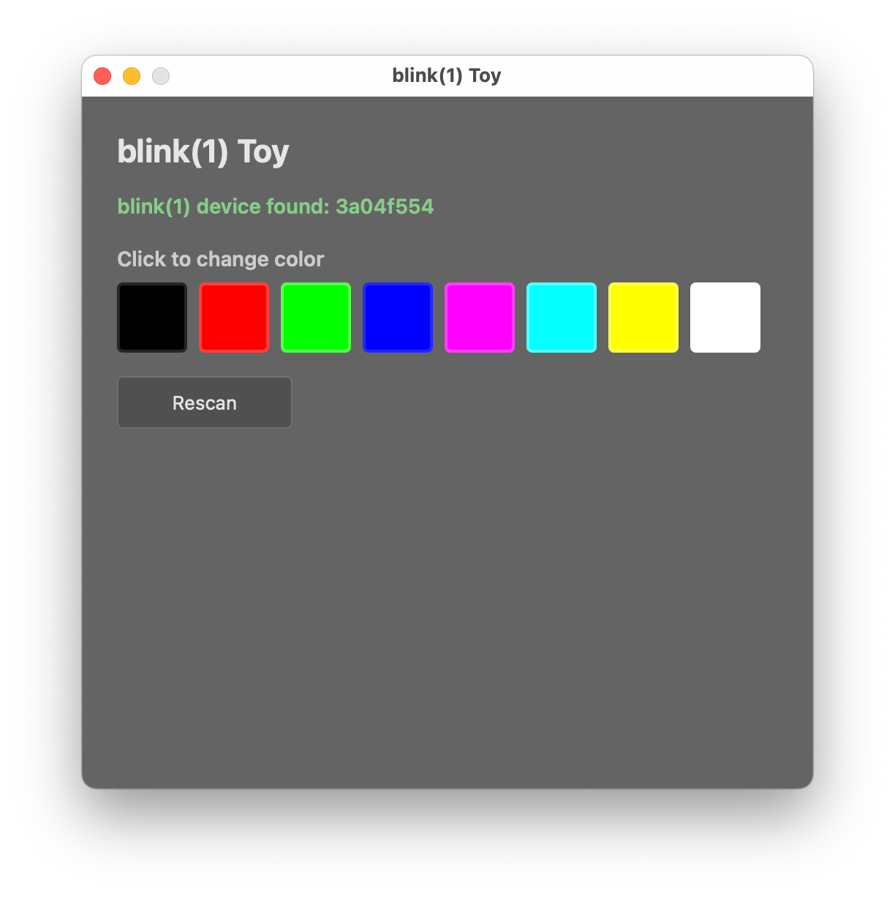

# tauri-blink1-toy

A simple [Tauri v2](https://tauri.app) app for controlling a [blink(1)](https://blink1.thingm.com) USB LED device.

Click a color swatch to fade the blink(1) to that color. Use the Rescan button to detect a device that was plugged in after launch.

This is a port of [electron-blink1-toy](https://github.com/todbot/electron-blink1-toy/) — same UI and behavior, rewritten with a Rust/Tauri backend instead of Electron/Node. USB HID access uses the [`hidapi`](https://crates.io/crates/hidapi) crate directly, with no native Node modules required.



## Requirements

- [Rust](https://rustup.rs) (stable)
- [Tauri CLI](https://tauri.app/start/): `cargo install tauri-cli`
- A [blink(1)](https://blink1.thingm.com) USB device (mk1, mk2, or mk3)
- macOS, Windows, or Linux


## Usage

```
make dev
```

The app scans for a blink(1) on launch. If none is found, plug one in and click **Rescan**.

## Build

```
make build              # release binary for current platform
make dist-mac-unsigned  # unsigned universal macOS .app (arm64 + x86_64)
make dist-mac           # signed + notarized universal macOS DMG (requires env vars below)
make dist-win-unsigned  # unsigned Windows NSIS installer (local testing)
make dist-win           # signed Windows NSIS installer (requires env vars below)
make dist-linux         # Linux .deb package + .zip of the binary
```

### macOS code signing & notarization

```bash
export APPLE_SIGNING_IDENTITY="Developer ID Application: Your Name (TEAMID)"
export APPLE_ID="your@email.com"
export APPLE_PASSWORD="xxxx-xxxx-xxxx-xxxx"
export APPLE_TEAM_ID="XXXXXXXXXX"
make dist-mac
```

- `APPLE_SIGNING_IDENTITY` — signs the binary; find the exact string with `security find-identity -v -p codesigning`
- `APPLE_PASSWORD` — notarizes with Apple's servers; must be an [App-Specific Password](https://support.apple.com/en-us/102431), not your Apple ID password (note: Electron calls this `APPLE_APP_SPECIFIC_PASSWORD`)
- `APPLE_ID` and `APPLE_TEAM_ID` — your Apple developer account credentials for notarization

### Windows code signing

Install the signing tool:

```powershell
cargo install trusted-signing-cli
```

Set the required environment variables:

```powershell
$env:AZURE_TENANT_ID = "your-tenant-id"
$env:AZURE_CLIENT_ID = "your-client-id"
$env:AZURE_CLIENT_SECRET = "your-client-secret"
```

Edit the `signCommand` in `src-tauri/tauri.conf.json` to set your Azure Trusted Signing endpoint URL, account name, and certificate profile name. Then run:

```powershell
make dist-win
```

The signing command is defined in `tauri.conf.json` under `bundle.windows.signCommand`. Tauri invokes it once per file that needs signing, passing the file path as `%1`.

### Icons

To regenerate icons from the original Electron project's `icon.icns`:

```
make extract-icon
```

Or supply your own 1024×1024 PNG:

```
make icons SRC=/path/to/icon-1024.png
```

## Architecture

| Layer | Technology |
|---|---|
| UI | Vanilla HTML/CSS/JS (`src/`) |
| IPC bridge | `src/blink1-bridge.js` — wraps `window.__TAURI__.core.invoke` |
| Backend | Rust (`src-tauri/src/lib.rs`) — three Tauri commands |
| USB/HID | `src-tauri/src/blink1.rs` — `hidapi` crate, VID `0x27B8` / PID `0x01ED` |

The three Tauri commands map 1:1 to the original Electron IPC channels:

| Tauri command | Electron channel |
|---|---|
| `blink1_set_color(r, g, b)` | `blink1:setColor` |
| `blink1_rescan()` | `blink1:rescan` |
| `blink1_get_devices()` | `blink1:getDevices` |


## Dependencies


### macOS

Install Rust via `rustup`:

```bash
curl --proto '=https' --tlsv1.2 -sSf https://sh.rustup.rs | sh
```

Then install the Tauri CLI:

```bash
cargo install tauri-cli
```

Xcode Command Line Tools are required (provides `clang`). If you haven't installed them:

```bash
xcode-select --install
```

### Windows

Install Rust via `rustup-init.exe` from [rustup.rs](https://rustup.rs) — choose the **MSVC** toolchain (the default), not GNU.

Install LLVM, which provides the `clang` compiler required by `tauri-cli` and `hidapi`:

```powershell
winget install LLVM.LLVM
```

After installing, open a new terminal and verify:

```powershell
clang --version
```

If `clang` is still not found, add LLVM to PATH manually. In an elevated PowerShell (search PowerShell in Start, right-click → "Run as administrator"):

```powershell
[System.Environment]::SetEnvironmentVariable("PATH", $env:PATH + ";C:\Program Files\LLVM\bin", "Machine")
```

Then open a new terminal and retry.

WebView2 (required by Tauri) is pre-installed on Windows 10 and 11.

## See also

- [`electron-blink1-toy`](../node/electron-blink1-toy/) — the original Electron version
- [`BlinkMSequencerTauri`](../BlinkMSequencerNew/BlinkMSequencerTauri/) — a more complete Tauri app using the same patterns, targeting the BlinkM/LinkM device
